<div align="center">



<p align="center">
  <b>Autonomous CI/CD Failure Diagnosis &amp; Automated Recovery Patch Engine</b>
</p>

<p align="center">
  
  
  
  
  
  
  
</p>

</div>

---

## Overview

CI Doctor AI is a developer tool and autonomous observability agent designed to eliminate the manual overhead of debugging broken CI/CD pipelines. When builds, test suites, or deployments fail, engineers frequently spend hours parsing massive terminal logs to identify the root cause.

CI Doctor AI integrates directly with GitHub Actions through the GitHub REST API (Octokit). It detects failed workflow runs, pulls execution logs, slices out the relevant error sections, and leverages Google Gemini 2.0 Flash to synthesize:
- A technical root-cause diagnosis
- A confidence rating and risk classification
- A list of affected source and configuration files
- An actionable remediation recommendation
- A unified git diff patch ready for pull request submission

In environments where external AI services are unreachable or subject to rate limits, CI Doctor AI automatically engages a heuristic regex pattern engine to guarantee continuous diagnosis.

---

## Architecture and Execution Topology

<div align="center">
  
</div>

The architecture consists of a reactive frontend dashboard, an orchestration backend, the GitHub Actions API, and the Gemini AI analysis layer:

1. **GitHub Actions Monitor**: Regularly surveys recent workflow runs across branches and commits.
2. **Log Extraction and Slicing**: Identifies failing jobs and stages, fetching job logs and isolating the trailing 3,000 characters to capture the root exception while keeping token payload minimal.
3. **AI Reasoning and Fallback Matrix**: Dispatches structured prompt payloads to Google Gemini 2.0 Flash (`temperature: 0.3`, `application/json`). If an API outage or rate limit occurs, the built-in pattern matcher assumes control.
4. **Patch Synthesizer**: Generates unified diffs (`+` additions, `-` removals), proposed PR branch names, and summary statements.
5. **In-Memory Store**: Caches all diagnoses and generated fixes to avoid redundant upstream API queries and compute costs.

---

## Key Capabilities

- **Real-Time Workflow Discovery**: Synchronizes with the GitHub Actions REST API to retrieve workflow runs, branches, authors, commit titles, and execution durations.
- **Granular Stage Tracking**: Breaks down each workflow into its constituent jobs and steps, highlighting the exact failure boundary (`test`, `lint`, `build`, `deploy`).
- **Targeted Log Slicing**: Downloads raw execution logs and applies intelligent truncation to preserve stack traces without token overflow.
- **Dual-Engine Diagnostic Safety**:
  - Primary: Gemini 2.0 Flash with JSON schema constraints.
  - Fallback: Heuristic regular-expression engine covering missing scripts, environment secrets, dependency imports, ESLint violations, timeouts, and permission rejections.
- **Automated Unified Diff Generation**: Produces syntactically valid patches targeting files like `package.json` or workflow YAML manifests.
- **Zero-Redundancy In-Memory Caching**: Avoids duplicate LLM token consumption by preserving analysis records by unique GitHub Run ID.
- **High-Density Dark Dashboard**: Built using React 19 and Tailwind CSS v4, providing visual status indicators, interactive pipeline pickers, and split-view failure and patch inspectors.

---

## Technology Stack

### Backend
- **Runtime**: Node.js (ECMAScript Modules)
- **Framework**: Express 4.21
- **GitHub Client**: Octokit REST API v4.1
- **AI Core**: Google Generative AI SDK (`@google/generative-ai` v0.21)
- **Environment and CORS**: dotenv, cors

### Frontend
- **Framework**: React 19.2
- **Build Tool**: Vite 8.0
- **Styling**: Tailwind CSS v4.3
- **Icons**: Lucide React 1.16

---

## REST API Reference

The backend exposes the following endpoints under `/api`:

| Method | Endpoint | Description |
|---|---|---|
| `GET` | `/api/health` | Service health status and uptime verification |
| `GET` | `/api/dashboard` | Aggregated metrics: total runs, failure count, recoveries, and confidence |
| `GET` | `/api/pipelines` | List of recent workflow runs enriched with diagnostic cache flags |
| `GET` | `/api/pipelines/:id/failure` | Step-by-step breakdown and extracted log output for a given run ID |
| `POST` | `/api/pipelines/:id/diagnose` | Triggers AI root-cause diagnosis for the target run |
| `POST` | `/api/pipelines/:id/fix` | Synthesizes a unified diff patch and PR proposal |
| `GET` | `/api/stats` | In-memory store statistics (cache counts and recoveries) |

---

## Repository Structure

```
ci-doctor-ai/
|-- .github/
|   `-- workflows/
|       |-- ci.yml                  # Continuous integration validation
|       `-- deploy.yml              # Multi-stage deploy with built-in test failure cases
|-- assets/
|   |-- header.svg                  # Animated SVG banner
|   `-- pipeline-flow.svg           # Animated architecture diagram
|-- backend/
|   |-- routes/
|   |   `-- api.js                  # Express API route controllers
|   |-- services/
|   |   |-- ai.js                   # Gemini 2.0 Flash client + heuristic engine
|   |   |-- github.js               # Octokit GitHub Actions client
|   |   `-- store.js                # In-memory caching and metrics store
|   |-- package.json
|   |-- server.js                   # Backend server entrypoint
|   `-- .env.example
|-- frontend/
|   |-- src/
|   |   |-- components/
|   |   |   |-- DiagnosisCard.jsx   # AI diagnosis display component
|   |   |   |-- FailurePanel.jsx    # Failed run details and log console
|   |   |   |-- FixPanel.jsx        # Patch diff viewer and PR metadata
|   |   |   |-- Navbar.jsx          # Header navigation
|   |   |   |-- PipelineList.jsx    # Interactive workflow run browser
|   |   |   `-- StatusCards.jsx     # High-level metric cards
|   |   |-- App.jsx                 # Main state coordinator and layout
|   |   |-- main.jsx                # React DOM entrypoint
|   |   `-- index.css               # Tailwind CSS v4 entry
|   |-- package.json
|   `-- vite.config.js
`-- README.md
```

---

## Getting Started

### Prerequisites

- Node.js 20.x or higher
- npm 10.x or higher
- GitHub Personal Access Token (`repo`, `actions:read`)
- Google Gemini API Key (obtainable via Google AI Studio)

---

### 1. Clone the Repository

```bash
git clone https://github.com/saifvector/ci-doctor-ai.git
cd ci-doctor-ai
```

---

### 2. Configure Backend Environment

Navigate to the `backend` directory and set up your environment variables:

```bash
cd backend
cp .env.example .env
```

Edit `backend/.env` with your credentials:

```ini
# GitHub Personal Access Token
GITHUB_TOKEN=ghp_your_personal_access_token_here

# Google Gemini API Key
GEMINI_API_KEY=your_gemini_api_key_here

# Target Repository
GITHUB_OWNER=your_github_username_or_org
GITHUB_REPO=ci-doctor-ai

# Server Port
PORT=3001
```

Install backend dependencies:

```bash
npm install
```

Start the backend development server:

```bash
npm run dev
```

The server will be available at `http://localhost:3001`.

---

### 3. Configure and Launch Frontend

Open a new terminal window, navigate to `frontend`, and install dependencies:

```bash
cd frontend
npm install
```

Start the Vite development server:

```bash
npm run dev
```

The frontend dashboard will run at `http://localhost:5173`. It connects automatically to `http://localhost:3001/api`.

---

## Validation and Simulation Scenarios

The repository includes `.github/workflows/deploy.yml`, which simulates real-world failure modes to exercise the AI diagnosis and self-healing engine:

### Scenario A: Missing Test Script
- **Trigger**: The workflow invokes `npm test` inside `./frontend`.
- **Failure**: `frontend/package.json` contains no `"test"` command, causing npm exit code 1.
- **Diagnosis**: CI Doctor AI flags the missing script error with high confidence.
- **Generated Patch**: Injects `"test": "echo \"No tests configured\" && exit 0"` into `package.json` or adds `--if-present` to the workflow file.

### Scenario B: Missing Secret / Environment Variable
- **Trigger**: The deployment step checks for the `$API_KEY` environment variable.
- **Failure**: Unset variable triggers an explicit exit 1.
- **Diagnosis**: Identifies unconfigured environment secrets.
- **Generated Patch**: Proposes workflow modifications injecting `${{ secrets.API_KEY }}` into the deployment job definition.

---

## Diagnostic Output Schema

When invoking `POST /api/pipelines/:id/diagnose`, the response adheres to the following contract:

```json
{
  "diagnosis": {
    "rootCause": "The pipeline failed because the 'test' script is missing from package.json.",
    "confidence": "95%",
    "affectedFiles": [
      "package.json",
      ".github/workflows/deploy.yml"
    ],
    "riskLevel": "Medium",
    "recommendation": "Add a 'test' script to package.json or update the workflow to run tests conditionally.",
    "category": "configuration"
  },
  "cached": false
}
```

When invoking `POST /api/pipelines/:id/fix`, the response returns:

```json
{
  "fix": {
    "title": "Fix missing test script in package.json",
    "confidence": "92%",
    "summary": "CI Doctor AI generated a recovery patch to add the missing 'test' script to package.json.",
    "filesChanged": [
      "package.json"
    ],
    "diff": "--- a/package.json\n+++ b/package.json\n@@ scripts\n+  \"test\": \"echo \\\"No tests configured\\\" && exit 0\",",
    "prTitle": "Fix CI pipeline failure: add missing test script",
    "prBranch": "fix/add-missing-test-script"
  },
  "cached": false
}
```

---

## Roadmap

- [ ] Automated Pull Request submission via Octokit write access
- [ ] Support for GitLab CI/CD and CircleCI pipelines
- [ ] Slack and Discord webhook alert integrations
- [ ] Historical failure clustering and recurring vulnerability analysis
- [ ] Multi-repository organization dashboards

---

## License

This project is licensed under the MIT License.
